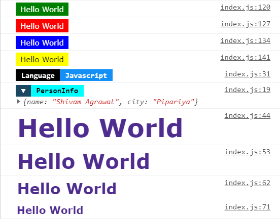
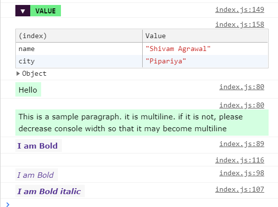

# cslog

> Colorful &amp; Simple React Console Logger

[](https://www.npmjs.com/package/cslog) [](https://standardjs.com)

## Install

```bash
npm install --save cslog
```





## Usage

```jsx
import React, { Component } from 'react'

import log from 'cslog'

const App = () => {
  log.success('Hello World') //debug messages
  log.error('Hello World')

  log.d(data, 'PersonInfo') //variable
  log.d(data)

  log.h1('Hello World') //Header tag
  log.hi('Hello JS', 'blue', 'yellow', true) //Blue text on yellow background, Broder: true

  log.p('This is a sample paragraph. it is multiline') //Paragraph tag
  log.p('I am different color text', 'white', 'purple') //White text on purple background

  log.b('I am Bold') //Bold

  log.bi('I am Bold italic') //Bold + Italic

  return <h2>Check Console</h2>
}

export default App
```

Color log variable values.

```jsx
const lname = 'I speak Hindi & English'
const data = {
  name: 'Shivam Agrawal',
  city: 'Pipariya'
}

log.d(lname, 'Language')
log.d(data, 'PersonInfo')
```

Debug messages

```jsx
log.success('Hello World')
log.error('Hello World')
log.info('Hello World')
log.warn('Hello World')
```

Simple HTML tags in console

```jsx
log.h1('Hello World')
log.h2('Hello World')
log.h3('Hello World')
log.h4('Hello World')

log.p('Hello')
log.p('This is a sample paragraph. it is multiline')
log.b('I am Bold')
log.br()
log.i('I am Bold')
log.bi('I am Bold italic')
```

All HTML functions accepts three options parameters

1. bg (background color)
2. fg (foreground color)
3. border (enable/disable border)

```jsx
log.h3('I am unique styled text', 'green', 'black', true) //Green text on black background, border enabled
```

#### Chage Global Settings

```jsx
log.border(true) //Enable border globally
log.setColor('red') //Set global color: red
```

If you like it

- [Follow me](https://github.com/shivampip) on Github

## License

MIT © [shivampip](https://github.com/shivampip)
